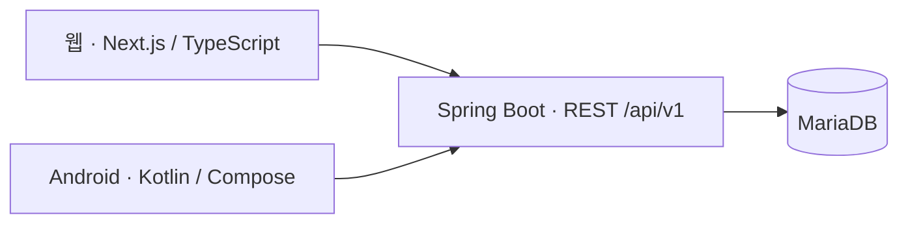

# PlanDoSee

2026-09-09 최신 상태: 공개/개인 웹을 [운영 주소](https://plandosee.app)에 배포했다. 계획/이력·할 일·실행/완료·검색/필터/정렬·돌아보기/근거·다음 계획·전체 JSON·휴지통/복제·이메일 계정·알림 설정을 연결했다. 타입/Windows·Linux 빌드, 단위13·격리 API/DB17·운영 HTTPS16개를 통과했다. 사용자 최신 지시로 소셜 로그인은 명시적으로 다시 요청할 때까지 작업을 보류한다. 실제 사용자 1/5/3·최종 DB 계약·전체 인수는 미완료. 상세: [웹 구현·검증](../PDC_Diary_Nextjs/docs/full-implementation.md). 아래 이전 단계 기록은 당시 상태다.

문서·AI 문맥 관리 검토: [여러 저장소의 문맥 관리와 RAG 도입안](docs/context-management.md) — 필수 자료 직접 읽기·정본/버전 관리·검색·검증을 결합하는 AI 추천. RAG 시스템은 아직 도입하지 않았습니다.

2026-09-09 공개 계획 구현: 사용자 채택 랜딩에서 [실제 계획 생성·수정·이력](../PDC_Diary_Nextjs/docs/f0-implementation.md)으로 연결했다. 격리 API/DB 대조·빌드/타입·단위 9개·브라우저 검증 완료. 나머지 업무·인증·운영 배포·전체 과제 검증은 남아 있다.

2026-09-09 사용자 확정: PDC_Diary_Security에 Spring·Next.js 등 항목별 보안점검과 설계를 기록한다. Spring 소스/설정 대조와 40개 점검표를 작성했고, Caddy의 Swagger 문서 인증 부재와 정적 보안 문제 2건(자원 사용 한도·reset/동시 로그인 경합)을 정리했다. 코드·운영 설정·비밀번호·DB 변경과 새 실행 시험은 하지 않았다. 공개 과제 조건과 API/DB 계약은 유지한다. [보안 점검 안내](docs/spring-security-review.md).

2026-09-09 최신: [Next.js 랜딩 디자인 초안](../PDC_Diary_Nextjs/docs/landing-design-draft.md) 제작·로컬 빌드/브라우저 확인. 실제 업무 저장·인증·웹 배포는 미완료다. 노션 10·02·03에 결과를 동기화했다.

2026-09-09 사용자 요청으로 `PDC_Diary_Nextjs`에 프론트 구현 구상을 작성했다. 서버 정상은 사용자 확인이며 이번에 재점검하지 않았다. 공개 Plan→Do→See→다음 Plan과 개인 화면, 이메일·세 소셜·휴지통·복제·알림을 기존 계약에 연결했다. 화면/폴더/단계/시간은 AI 제안이며 앱 코드는 미구현이다. [Next.js 구상 요약](docs/frontend-implementation-plan.md)과 형제 저장소의 상세 계획·44개 추적·검증 기록을 따른다.

배포 이해·면접 준비: [로컬 설명서](docs/deployment-interview-guide.md) · [노션 학습 페이지](https://app.notion.com/p/3d50def9f6268114b1b2cf7b997b3ee7?pvs=204)

최신 배포 증거: [DB·백엔드·메일 배포 진행](docs/deployment-status.md) — 내부 API·21개 표 복원·메일 수신 확인, 공개 DNS/HTTPS·API·Swagger 확인 완료, 프론트는 미구현.

**계획 → 실제 실행 → 돌아보기 → 다음 계획**

내가 세운 계획과 실제로 한 일을 비교하고, 고칠 점 한 줄을 다음 계획에 반영하는 다이어리입니다.

`Plan-Do-See/PDC_Diary`는 프로젝트의 **요구사항·기술 구상·데이터 계약·검증 기준**을 관리하는 구상 저장소입니다. 웹·백엔드·Android·인프라 구현은 각각 별도 저장소로 구성합니다.

[노션 문서 목차](https://app.notion.com/p/3d50def9f6268037adfbcef233c6d20c) · [필수 RULE](RULES.md) · [개발·배포 준비물](docs/preparation-guide.md) · [Swagger/API](docs/swagger/README.md) · [프론트 연동](docs/frontend-integration.md)

> 이 저장소는 설계·계약·검증 기록을 관리합니다. 별도 백엔드의 DB·API·HTTPS·Swagger 배포와 부분 검증은 완료했습니다. 프론트 구현·소셜 외부 연결·전체 과제 인수 검증은 남아 있으며, 이번 로컬 변경은 아직 Git에 커밋·push하지 않았습니다.

- 서비스 도메인: `plandosee.app` — 구매 완료(사용자 확인), DNS·HTTPS·백엔드 연결 확인, 프론트 미구현
- 웹 과제 계획: 준비된 환경 기준 **8~10시간**. 이번에 추가하는 개인 계정·인증과 Android 개발·검증 일정은 별도
- 이번 구현 범위: **공개 과제 공간 + 개인 계정 영역**. 이메일 가입·카카오·네이버·구글 로그인, 개인 기록 우선·향후 공동 편집 고려 — [백엔드 구성 결정](docs/backend-decisions.md)

## 만들 기능

| 단계 | 핵심 기능 |
|---|---|
| **Plan · 계획** | 기간·우선순위·성공 기준·예상 시간 저장. 수정해도 최초·이전 버전 보존 |
| **할 일** | 생성·수정·완료·되돌리기·삭제. 마감·태그·예상 시간, 검색·필터·정렬 |
| **Do · 실행** | 할 일별 시작·종료·실제 시간·막힌 이유 기록. 계획값 보존, 중복 완료 방지 |
| **See · 돌아보기** | 계획·완료·지연·막힘 수와 예상/실제 차이. 숫자에서 근거 기록으로 이동 |
| **다음 계획·자료** | 개선점 한 줄을 다음 계획에 연결. 서버 DB 저장·새로고침 복원·전체 JSON 내보내기 |

## 기술 구성

| 영역 | 설계 기준 |
|---|---|
| 웹 | Next.js App Router · React · TypeScript · Node.js 24 LTS |
| Android | Kotlin · Jetpack Compose · ViewModel · Coroutines/Flow |
| 백엔드 | Spring Boot 4.1.x · Java 21 LTS · Spring JDBC |
| DB | MariaDB 12.3 LTS · InnoDB · Flyway |
| 운영 | Linux VPS · Docker Compose · Caddy · 외부 비공개 백업 |

초기 웹 조회는 SSR, 편집·DnD 등 상호작용은 Client Component가 담당합니다. 저장·집계·날짜 판정·중복 방지는 공통 Spring API에서 처리합니다. MariaDB·Flyway 등 정확한 버전 조합은 실제 호환 시험 후 고정합니다.

배포는 클라우드 서버 1대에서 시작하고 동일 컨테이너·MariaDB 덤프/복원·환경 설정으로 WTR Pro 이전을 준비합니다. 2026-09-08 후속 결정: 사용자가 JDBC·Spring Security·웹 JDBC 세션·외부 SMTP와 휴지통 복원(REC-01)·계획 틀 복제(REC-02)·선택형 알림(REC-03)을 모두 채택했다. n8n은 후속 알림·운영 자동화로 검토하고 인증 메일은 Spring에서 외부 SMTP로 전송한다. 클라우드부터 구현하고 WTR Pro로 이전할 수 있도록 준비한다. [구성 결정](docs/backend-decisions.md)을 참고합니다.

## 현재 GitHub 저장소

2026-09-09 사용자 제공 GitHub 화면 기준으로 현재 원격 저장소는 아래 5개다. 공개 범위는 화면에서 확인했으며 새 시크릿 창의 접근 검사를 이번에 실행한 것은 아니다.

| 저장소 | 공개 범위 | 담당 |
| --- | --- | --- |
| PDC_Diary | Public | 전체 구상·RULE·결정·문서/노션 연결 |
| PDC_Diary_Spring | Public | 백엔드 구현·API/DB 계약·migration·테스트 |
| PDC_Diary_Nextjs | Public | 프런트엔드 구현·SSR·화면·웹 테스트 |
| PDC_Diary_Security | Private | 영역별 보안 분석·점검·보호 설계 |
| PDC_Diary_Optimization | Private | 성능 개선 분석·설계 및 최적화 분석·설계 |

`PDC_Diary_Infra`는 기존 로컬 독립 Git 작업 영역(`workspaces/PDC_Diary_Infra`)으로 유지하며 제공된 GitHub 목록에는 없다. Android 저장소는 향후 분리 계획으로 유지한다. 두 항목을 현재 GitHub 저장소 5개에 포함하지 않는다.

Optimization은 분석·설계를 담당하고 실제 코드 변경과 검사는 해당 구현 저장소에 연결합니다. [저장소 목록 JSON](docs/repository-inventory.json) · [문맥 관리안](docs/context-management.md).

Windows·macOS에서는 우선 웹을 제공하고 네이티브 앱은 이후 검토합니다. iOS는 현재 개발·배포 범위에서 제외합니다.

## 문서 안내

| 문서 | 읽는 목적 |
|---|---|
| [최신 결정](docs/latest-review.md) | 현재 기술·인프라·도메인과 미확인 항목 |
| [기능·데이터 설계](docs/pds-design.md) | 화면 흐름·집계·날짜·중복 방지 규칙 |
| [저장소 구성](docs/repository-layout.md) | 저장소별 책임·파일 배치·API 경계 |
| [개발·배포 준비물](docs/preparation-guide.md) | PC 도구·계정·서버·Android 준비 |
| [필수 RULE](RULES.md) · [작업 규칙](AGENTS.md) | 구현·문서 변경 시 지켜야 할 기준 |
| [44개 요구사항 원문](docs/requirements.json) | T06 항목과 검증 방법 연결 |
| [DB 계약 초안](contracts/pds-schema-v2.json) | 표·필드·관계·제약·시간대·단위 |

DB 계약은 최종 배포 검증 전의 `design` 상태이며 로컬 MariaDB 관측·14개 검사는 별도 기록했습니다. 정본은 백엔드 저장소에 있고, 구상 저장소에 동일한 DB·OpenAPI 미러와 출처 해시를 유지합니다.

## 구현 순서와 완료 기준

1. 개발 환경·각 저장소·기본 프로젝트를 준비하고 DB 연결과 첫 migration을 검증합니다.
2. Plan → 할 일 → Do → See → 다음 Plan을 구현하고 실제 본인 자료를 입력합니다.
3. 배포 후 필수 조건 전체와 새로고침·내보내기·공개 접근·보안·복구를 확인하고 증거를 보관합니다.

**본인 계획 1개 이상 · 같은 계획의 할 일 5개 이상 · 실제 실행 기록 3개 이상**이 필요합니다. 예시·검사용 데이터를 실제 기록으로 세지 않습니다.

필수 **44개 조건과 번호 없는 조건을 모두 충족**해야 합니다. 미검증·실패가 하나라도 있으면 과제 완료로 표시하지 않습니다. 결과물·소스 URL, 확인 방법 4줄, AI와 본인 판단 3줄도 제출합니다.

## 공개 안내와 문서 관리

첫 화면에는 다음 문구를 그대로 표시합니다.

> 지금은 로그인이 없어 링크를 아는 사람은 누구나 볼 수 있습니다. 남이 봐도 괜찮은 내용만 넣으세요

공개 과제 공간에서는 열람·수정을 포함한 모든 필수 기능을 로그인 없이 제공합니다. 위 안내는 공개 과제 공간에 해당하며, 이번에 함께 구현하는 개인 계정 영역은 로그인과 접근 권한을 검사합니다. 개인 기록이 공개 목록·집계·내보내기 등에 섞이지 않게 분리합니다. 민감한 내용·타인 개인정보·비밀키를 저장소나 공개 자료에 넣지 않습니다.

계획·기술·기능·일정이 바뀌면 **로컬 Markdown·JSON과 노션을 같은 작업에서 갱신하고 재조회로 확인**합니다. PDF는 관리 대상에서 제외하며, 재요청 전에는 생성하지 않습니다. 노션 페이지와 동기화 기록은 [문서 연결 정보](docs/notion-publication.json)에 보관합니다.

## 백엔드 구현 결과 · 2026-09-08

백엔드 구현 결과(2026-09-08): PDC_Diary_Spring에 계정·공간·세션·도메인 API와 Flyway V1~V3, 휴지통 복원·틀 복제·선택형 이메일 알림을 작성했다. MariaDB 12.3.3 로컬 검사 14개와 21개 표 덤프→복원 대조가 통과했다. Compose 구조 검사도 통과했다. 실제 외부 OAuth·Brevo 수신·클라우드/WTR·웹/Android 검증은 남아 있다. [검증 기록](docs/backend-verification.md)을 따른다.

백엔드 정본은 `D:/workspace/PDC_Diary_Spring`, 독립 인프라 저장소는 `D:/workspace/PDC_Diary/workspaces/PDC_Diary_Infra`입니다. API·DB 계약과 배포/이전 절차를 준비했습니다. 원격 push·서버 구매·실제 배포는 수행하지 않았습니다.

## 무료 호스팅·메일 준비·프론트 API 후속 지시

2026-09-08 최신 결정: 사용자가 최종 클라우드 제공자로 Vultr를 선택했다. 사용자는 작은 클라우드 서버로 줄일 필요가 없고 한 달 안에 이전할 것으로 예상한다고 밝혔다. WTR Pro로의 이전을 목표로 서울(icn) Shared CPU AMD High Performance 8vCPU·RAM 16GB·350GB 한 대를 체험용으로 추천하며 공식 카탈로그의 서버 요금은 월 US$96이다. US$250·최대 30일 프로모션의 실제 적용/만료는 확인 전이다. 새 한국 서버의 DB·백엔드·Caddy 배포와 SMTP 시험을 확인했다. 공개 HTTPS·API·Swagger는 확인했고 프론트는 미구현이다. Brevo 도메인 Authenticated는 사용자 진술로 확인했다. 발신자 PlanDoSee <no-reply@plandosee.app>의 서버 SMTP 시험을 통과했고, 사용자가 네이버 받은편지함 도착을 확인했다. 소셜 제공자 앱 등록·키·콜백·검수는 프론트 완성 뒤 한 번에 진행한다. 클라우드부터 운영하고 WTR Pro로 후속 이전하는 방침을 유지한다. 구상 저장소의 OpenAPI 0.2.0·Swagger UI·프론트 안내는 42개 경로·59개 작업·38개 모델·예시 43개와 소스 대조/브라우저 검사를 통과했다.

[사용자 준비물 한 번에 보기](docs/user-preparation.md) · [프론트 연동 안내](docs/frontend-integration.md) · [Swagger 실행](docs/swagger/README.md) · [무료 호스팅 비교](docs/cloud-options.md)
