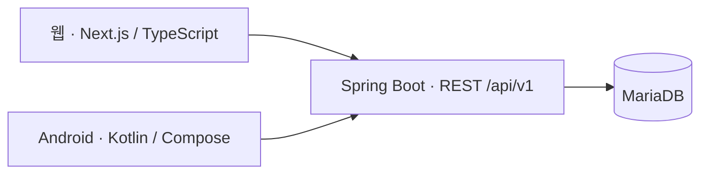

# PlanDoSee

**계획 → 실제 실행 → 돌아보기 → 다음 계획**

내가 세운 계획과 실제로 한 일을 비교하고, 고칠 점 한 줄을 다음 계획에 반영하는 다이어리입니다.

`Plan-Do-See/PDC_Diary`는 프로젝트의 **요구사항·기술 구상·데이터 계약·검증 기준**을 관리하는 구상 저장소입니다. 웹·백엔드·Android·인프라 구현은 각각 별도 저장소로 구성합니다.

[노션 문서 목차](https://app.notion.com/p/3d50def9f6268037adfbcef233c6d20c) · [필수 RULE](RULES.md) · [개발·배포 준비물](docs/preparation-guide.md)

> 현재는 설계·요구사항 정리 단계입니다. 이 저장소에는 실행 가능한 앱이 없으며, 실제 DB·기능·배포 검증은 아직 수행하지 않았습니다.

- 서비스 도메인: `plandosee.app` — 구매 완료(사용자 확인), DNS·HTTPS·배포 연결 미확인
- 웹 과제 계획: 준비된 환경 기준 **8~10시간**. Android 개발·기기 검사·배포는 별도

## 만들 기능

| 단계 | 핵심 기능 |
|---|---|
| **Plan · 계획** | 기간·우선순위·성공 기준·예상 시간 저장. 수정해도 최초·이전 버전 보존 |
| **할 일** | 생성·수정·완료·되돌리기·삭제. 마감·태그·예상 시간, 검색·필터·정렬 |
| **Do · 실행** | 할 일별 시작·종료·실제 시간·막힌 이유 기록. 계획값 보존, 중복 완료 방지 |
| **See · 돌아보기** | 계획·완료·지연·막힘 수와 예상/실제 차이. 숫자에서 근거 기록으로 이동 |
| **다음 계획·자료** | 개선점 한 줄을 다음 계획에 연결. 서버 DB 저장·새로고침 복원·전체 JSON 내보내기 |

## 기술 구성

| 영역 | 설계 기준 |
|---|---|
| 웹 | Next.js App Router · React · TypeScript · Node.js 24 LTS |
| Android | Kotlin · Jetpack Compose · ViewModel · Coroutines/Flow |
| 백엔드 | Spring Boot 4.1.x · Java 21 LTS · Spring JDBC |
| DB | MariaDB 12.3 LTS · InnoDB · Flyway |
| 운영 | Linux VPS · Docker Compose · Caddy · 외부 비공개 백업 |

초기 웹 조회는 SSR, 편집·DnD 등 상호작용은 Client Component가 담당합니다. 저장·집계·날짜 판정·중복 방지는 공통 Spring API에서 처리합니다. MariaDB·Flyway 등 정확한 버전 조합은 실제 호환 시험 후 고정합니다.

배포는 서버 1대에서 시작하는 구상입니다. Caddy가 웹 요청은 Next.js로, `/api/v1`은 Spring Boot로 전달합니다. 비용·용량 판단은 [인프라 계획](docs/latest-review.md)을 참고합니다.

## 저장소 분리 계획

| 저장소 | 담당 |
|---|---|
| **PDC_Diary · 현재 저장소** | RULE · 설계 · 계약 초안 · 노션 동기화 · 검증 증거 |
| PDC_Diary_Backend | 공통 API · DB migration · OpenAPI · 최종 DB 계약 |
| PDC_Diary_Web | Next.js 웹 화면·SSR·웹 테스트 |
| PDC_Diary_Android | Kotlin·Compose 앱·네이티브 기능·기기 테스트 |
| PDC_Diary_Infra | 배포·백업·복구·실행 버전 관리 |

Windows·macOS에서는 우선 웹을 제공하고 네이티브 앱은 이후 검토합니다. iOS는 현재 개발·배포 범위에서 제외합니다.

## 문서 안내

| 문서 | 읽는 목적 |
|---|---|
| [최신 결정](docs/latest-review.md) | 현재 기술·인프라·도메인과 미확인 항목 |
| [기능·데이터 설계](docs/pds-design.md) | 화면 흐름·집계·날짜·중복 방지 규칙 |
| [저장소 구성](docs/repository-layout.md) | 저장소별 책임·파일 배치·API 경계 |
| [개발·배포 준비물](docs/preparation-guide.md) | PC 도구·계정·서버·Android 준비 |
| [필수 RULE](RULES.md) · [작업 규칙](AGENTS.md) | 구현·문서 변경 시 지켜야 할 기준 |
| [44개 요구사항 원문](docs/requirements.json) | T06 항목과 검증 방법 연결 |
| [DB 계약 초안](contracts/pds-schema-v2.json) | 표·필드·관계·제약·시간대·단위 |

DB 계약은 현재 `design` 상태이며 실제 DB와 대조하기 전입니다. 백엔드 구현 시작 시 계약 정본을 해당 저장소로 이관하고, 이 저장소에서는 고정된 릴리스를 참조합니다.

## 구현 순서와 완료 기준

1. 개발 환경·각 저장소·기본 프로젝트를 준비하고 DB 연결과 첫 migration을 검증합니다.
2. Plan → 할 일 → Do → See → 다음 Plan을 구현하고 실제 본인 자료를 입력합니다.
3. 배포 후 필수 조건 전체와 새로고침·내보내기·공개 접근·보안·복구를 확인하고 증거를 보관합니다.

**본인 계획 1개 이상 · 같은 계획의 할 일 5개 이상 · 실제 실행 기록 3개 이상**이 필요합니다. 예시·검사용 데이터를 실제 기록으로 세지 않습니다.

필수 **44개 조건과 번호 없는 조건을 모두 충족**해야 합니다. 미검증·실패가 하나라도 있으면 과제 완료로 표시하지 않습니다. 결과물·소스 URL, 확인 방법 4줄, AI와 본인 판단 3줄도 제출합니다.

## 공개 안내와 문서 관리

첫 화면에는 다음 문구를 그대로 표시합니다.

> 지금은 로그인이 없어 링크를 아는 사람은 누구나 볼 수 있습니다. 남이 봐도 괜찮은 내용만 넣으세요

현재 과제에서는 열람·수정을 포함한 모든 기능을 로그인 없이 제공합니다. 민감한 내용·타인 개인정보·비밀키를 저장소나 공개 자료에 넣지 않습니다. 접근 제어는 7번 과제에서 다룹니다.

계획·기술·기능·일정이 바뀌면 **로컬 Markdown·JSON과 노션을 같은 작업에서 갱신하고 재조회로 확인**합니다. PDF는 관리 대상에서 제외하며, 재요청 전에는 생성하지 않습니다. 노션 페이지와 동기화 기록은 [문서 연결 정보](docs/notion-publication.json)에 보관합니다.
