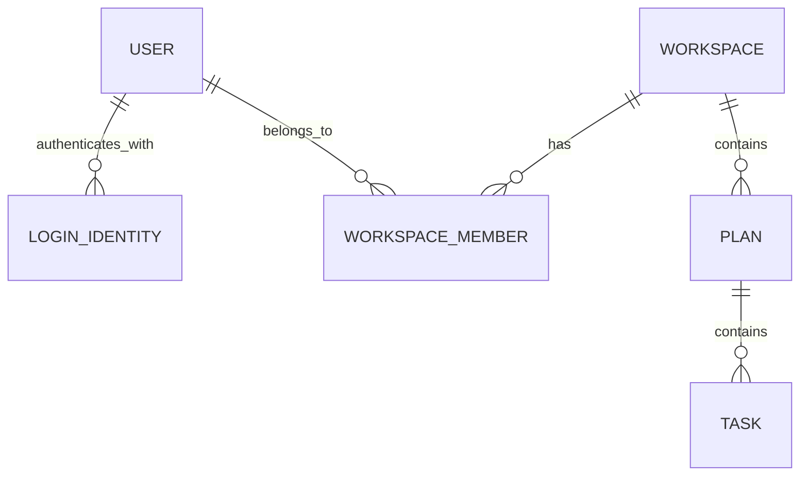

# 백엔드 구성 추천과 근거

최신 배포 증거: [DB·백엔드·메일 배포 진행](deployment-status.md) — 내부 API·21개 표 복원·메일 수신 확인, 공개 DNS/HTTPS·API·Swagger 확인 완료, 프론트는 미구현.

2026-09-08 / 종전 인증·기능 추천은 사용자가 채택했다. 클라우드 제공자 추천은 아직 선택 전이며 구현·실제 검증·배포 상태는 별도로 기록한다.

## 사용자 답변으로 확정한 것

- 이번에 공개 과제 공간과 로그인하는 개인 계정 영역을 함께 구현한다.
- 이메일 가입과 카카오·네이버·구글 소셜 로그인을 모두 제공한다. 특정 수단을 생략하지 않는다.
- 현재 개인 기록은 본인만 조회·수정한다. 향후 공동 편집 확장을 고려하되 현재 초대·공유·공동 편집을 구현 범위에 넣지 않는다.
- WTR Pro는 Ryzen 7 5825U·RAM 32GB·6TB×2·2TB×1이며 CCTV용 하드로 24시간 사용 가능하다는 사용자 진술이다. 초기 이용자는 약 10명 예상이다. 실제 가용성·OS·외부 접속·월 예산은 미확인이다. 초기 운영은 클라우드, WTR Pro는 후속 이전 대상이다.
- 사용자는 n8n을 전혀 다룰 줄 모르며 ChatGPT 유료 구독이 있다고 알렸다. n8n은 권고한 대로 후속 자동화로 검토하고 초기 인증 메일은 외부 SMTP로 처리한다.
- 작업 중 설명과 중간 결과를 자주 제공하고 단계별 결정·변경·검증 결과를 노션에도 항상 기록한다.

## 기술 추천

| 부분 | 추천 | 이 프로젝트에서의 이유 |
| --- | --- | --- |
| 기본 서버 | 기존 Java 21·Gradle·Spring Boot MVC 유지 | 웹·Android 공통 API와 기존 설계를 이어 간다. 정확한 버전은 첫 빌드·DB 호환 검증 후 고정한다. |
| DB 접근 | 기존 Spring JDBC 유지, JdbcClient 등 사용 검토 | 계획 버전·완료 행 잠금·집계 SQL이 이미 명시되어 있다. 실행되는 SQL과 트랜잭션 경계를 직접 확인하기 좋다. JPA를 추가로 배우는 부담을 먼저 늘리지 않는다. |
| DB 변경 | MariaDB + Flyway 유지 | 스키마 변경을 파일로 기록하고 같은 DB에서 검증한다. |
| 인증 | Spring Security + OAuth2 Client | 이메일 자격증명과 세 소셜 로그인 결과를 하나의 내부 사용자 계정으로 연결한다. |
| 웹 로그인 유지 | Spring Session JDBC + 보안 쿠키 | 서버의 MariaDB에 세션을 저장하는 제안이다. 초기 운영에 별도 세션 저장 서버를 추가하지 않아도 된다. |
| 메일 | Spring Mail → Brevo SMTP 연결 예시 | 가입/복구 메일을 암호화 큐에 저장하고 제한 재시도한다. 계정·발신 도메인 인증·실발송 검증은 남아 있다. |
| 자동화 | n8n은 후속 회고 알림·운영 자동화 후보 | 첫 버전의 인증 경로에 별도 워크플로 서비스 의존성을 추가하지 않는다. 필요가 확인되면 작은 흐름 하나로 학습한다. |

위 표는 사용자 후속 답변으로 채택했다. Spring JDBC가 JPA보다 모든 프로젝트에 적합하다는 뜻은 아니다. JPA는 일반 CRUD의 반복 코드를 줄일 수 있지만 이 프로젝트의 잠금·집계·원천 기록 검증에는 명시적인 SQL이 계속 필요하다. [Spring JDBC](https://docs.spring.io/spring-framework/reference/data-access/jdbc/core.html), [Spring OAuth2 Login](https://docs.spring.io/spring-security/reference/servlet/oauth2/login/), [Spring Session JDBC](https://docs.spring.io/spring-session/reference/configuration/jdbc.html).

## 이메일·n8n·ChatGPT의 역할

SMTP는 이메일을 전송하는 방식이고 n8n은 여러 작업을 연결하는 자동화 도구다. n8n의 Send Email 노드도 SMTP 서버와 계정에 연결해 메일을 보낸다. 따라서 n8n 설치만으로 발송 서비스가 준비되지는 않는다. [n8n Send Email](https://docs.n8n.io/integrations/builtin/core-nodes/n8n-nodes-base.sendemail/).

초기 제안은 Spring에서 인증 메일을 만들어 외부 SMTP로 전달하는 것이다. Spring Boot는 JavaMailSender 자동 구성을 제공한다. 메일 서버 연결·읽기·쓰기 시간 제한, 재발송 제한, 실패 상태를 명시하고 메일 실패를 가입 인증 성공으로 표시하지 않는다. 개발 중에는 메일 수신 테스트 도구로 확인하고 실제 메일은 제공자·발신 도메인 준비 후 검증한다. [Spring Mail](https://docs.spring.io/spring-boot/reference/io/email.html).

Resend는 앞서 검토한 대안이다. 현재 설정 예시는 사용자 후속 대화에 따라 Brevo 기준이다. Resend도 SMTP와 발신 도메인 검증을 제공한다. 현재 plandosee.app의 메일 발신 설정·SMTP 계정·요금·쿼터는 확인 전이다. 기존 DNS나 메일 설정은 임의로 바꾸지 않는다. [Resend SMTP](https://resend.com/docs/send-with-smtp).

일반 n8n 워크플로와 메일 발송에 GPT는 필수가 아니다. n8n에서 OpenAI API를 호출하는 경우 API 이용 비용은 ChatGPT 구독과 별도로 계산한다. ChatGPT 구독으로 개발 설명·설계 도움을 받는 것과 운영 서비스가 API를 자동 호출하는 것은 과금 경로가 다르다. n8n Cloud의 별도 Gateway credits 옵션도 ChatGPT 구독을 API 사용권으로 바꾸지는 않는다. [OpenAI 인증·API 과금](https://learn.chatgpt.com/docs/auth), [n8n OpenAI 인증 문서](https://github.com/n8n-io/n8n-docs/blob/main/docs/integrations/builtin/credentials/openai.md).

## 계정과 공동 편집 확장을 위한 구조 제안

- 서비스 내부 사용자 ID와 로그인 수단을 분리한다. 외부 로그인은 제공자와 고유 식별자의 조합으로 찾는다. Google은 sub, Kakao는 회원번호 id, Naver는 response.id를 사용하도록 설계한다. 이메일이 같다는 이유만으로 계정을 자동 합치지 않고, 기존 계정에 로그인한 상태에서 추가 로그인 수단을 확인하는 연결 흐름을 제안한다. [Google 식별자](https://developers.google.com/identity/openid-connect/openid-connect), [Kakao 로그인](https://developers.kakao.com/docs/ko/kakaologin/rest-api), [Naver 개발가이드](https://developers.naver.com/docs/login/devguide/devguide.md).
- 이메일 가입은 이메일 소유 확인 + 비밀번호 방식을 제안한다. 비밀번호는 Spring PasswordEncoder로 단방향 해시 저장하고, 인증·재설정용 일회성 값은 용도·만료·사용 여부를 관리한다. 소셜 로그인에 이메일 정보가 항상 제공된다고 가정하지 않는다. [비밀번호 저장](https://docs.spring.io/spring-security/reference/features/authentication/password-storage.html).
- 자료는 공개/개인 공간에 귀속시키고 사용자와 공간의 멤버 관계를 분리하는 방식을 제안한다. 현재 개인 공간은 소유자 한 명만 허용한다. 향후 공동 편집은 멤버와 역할을 늘리되 기존 계획의 소유 범위를 다시 해석하지 않도록 한다.
- 기존 아홉 도메인 표에 공간별 FK·요청 키를 적용하고 계정/세션/토큰/메일/알림 표를 migration으로 구현했다. 실제 MariaDB 관측을 계약에 추가했다. 배포 commit을 포함한 최종 검증 전이므로 전역 계약은 design 상태를 유지한다.
- 웹 세션에는 Secure·HttpOnly·적절한 SameSite 설정과 CSRF 검사를 적용하는 제안이다. 공개 과제의 무인증 기능은 유지하되 개인 요청의 권한 검사를 우회하지 못하게 한다. Android 로그인 인계·자격증명 전달 계약은 별도 확정·시험하며 웹 쿠키 제안만으로 앱 인증까지 완료됐다고 보지 않는다. [Spring CSRF](https://docs.spring.io/spring-security/reference/servlet/exploits/csrf.html).

소셜 제공자 앱 등록·허용 콜백 주소·요청 정보 설정과 필요한 검수가 남아 있다. 특히 Naver는 검수 승인 전 이용 가능한 계정에 제한이 있으므로 실제 서비스 공개 검증과 개발 테스트를 구분한다. [Naver 검수 안내](https://developers.naver.com/docs/login/devguide/devguide.md).

## WTR Pro 활용 판단

**클라우드 우선·WTR Pro 후속 이전 준비가 사용자 확정 사항**이다. WTR Pro는 Ryzen 7 5825U·RAM 32GB·6TB×2·2TB×1이며 CCTV용 하드로 24시간 사용 가능하다는 사용자 진술이다. 초기 이용자는 약 10명 예상이다. 실제 가용성·OS·외부 접속·월 예산은 미확인이다. 초기 운영은 클라우드, WTR Pro는 후속 이전 대상이다.

클라우드에서 먼저 DB·API·웹을 구현한다. 같은 이미지·환경 변수·MariaDB 백업과 복원 절차를 사용하며, 이전은 별도 복원 DB에서 검증한 뒤 쓰기 중단·최종 덤프·복원·DNS 전환 순서로 수행한다.

Docker 또는 별도 VM으로 앱을 격리하고 NAS 관리 화면·공유 폴더·DB 포트를 공개 앱과 분리한다. 기존 디스크·RAID·파일은 변경하지 않는다. 같은 장비 안의 디스크 복제만으로 장비 전체 장애에 대비한 백업이 되지는 않으므로, 기존 RULE의 장비 밖 비공개 백업·복구 확인을 유지한다. 전기·외부 백업·메일 비용을 포함한 월 예산 상한은 아직 미정이다.

## 추가 기능 — 사용자 채택

| ID | 기능 | 이유와 범위 |
| --- | --- | --- |
| REC-01 | 삭제한 할 일의 휴지통·복원 | 기존 soft delete를 사용해 오삭제를 되돌린다. 복원 뒤 집계·중복 완료 상태를 함께 검증해야 한다. |
| REC-02 | 계획·할 일 틀 복제 | 다음 계획을 빠르게 만들되 날짜·성공 기준을 본인이 확인한다. 실제 실행 기록·완료 사건·회고 판단은 복사해 실제 기록처럼 만들지 않는다. |
| REC-03 | 선택형 마감·회고 알림 | 사용자가 수신 여부·시각을 정한다. 최초에는 한 채널로 검증하며 n8n은 구현 후보 중 하나다. |

이 세 기능은 사용자가 채택한 추가 범위다. 기존 44개 원문은 바꾸지 않고 별도의 REC 인수 기준으로 추적한다. 이메일 확인·비밀번호 재설정·연결된 로그인 수단 확인은 요청한 계정 기능을 사용할 수 있도록 하는 기본 인증 설계로 따로 다룬다.

## 진행과 남은 확인

이번 단계: 사용자 채택·클라우드 우선 반영, 백엔드 API/migration·배포/이전 준비물 작성과 로컬 통합·복원 시험. 다음 단계: 외부 계정 연결·클라우드/웹·실제 이메일/소셜 로그인 검증. 매 단계에서 무엇을 바꿨는지·왜 바꿨는지·무엇을 실제 확인했는지·남은 일을 채팅과 노션에 기록한다. 자격증명·개인 기록 원문은 노션 진행 기록에 복사하지 않는다.

Java 21.0.12.1과 Spring Boot 4.1.1·Gradle 9.7.1 컴파일을 확인했다. JDK 소켓 전용 임시 경로를 지정하여 로컬 빌드 오류를 해결했다. 사용자가 알려 준 MariaDB 포트는 3919이고 127.0.0.1:3919 초기 응답에서 12.3.3을 확인했다. 기존 DB 로그인·데이터 변경은 하지 않았다. 상세 실행 증거는 후속 검증 기록에 남긴다.

## 메일 전달률 후속 답변

메일 설정 예시는 Brevo SMTP(smtp-relay.brevo.com:587, STARTTLS) 기준으로 준비한다. SMTP 로그인과 SMTP 키는 환경 변수로 주입한다. 발신 도메인 인증(Brevo code·DKIM·DMARC), 트랜잭션 발송 활성화, Gmail·네이버 실제 수신 확인은 남아 있다. 외부 서비스를 써도 받은편지함 도착을 보장하지 않으며, WTR 이전 후에도 같은 외부 SMTP를 유지한다.

[Brevo SMTP](https://help.brevo.com/hc/en-us/articles/7924908994450-Send-transactional-emails-using-Brevo-SMTP) · [발신 도메인 인증](https://help.brevo.com/hc/en-us/articles/12163873383186-Authenticate-your-domain-with-Brevo-Brevo-code-DKIM-DMARC)

## 구현·검증 결과

백엔드 구현 결과(2026-09-08): PDC_Diary_Spring에 계정·공간·세션·도메인 API와 Flyway V1~V3, 휴지통 복원·틀 복제·선택형 이메일 알림을 작성했다. MariaDB 12.3.3 로컬 검사 14개와 21개 표 덤프→복원 대조가 통과했다. Compose 구조 검사도 통과했다. 실제 외부 OAuth·Brevo 수신·클라우드/WTR·웹/Android 검증은 남아 있다. [검증 기록](backend-verification.md)을 따른다.

## 저가 클라우드 후속 추천 · 제공자 미선정

최종 사용자 선택은 Vultr다. 한 달 안에 WTR Pro로 이전할 것이라는 사용자 예상에 맞춰, 체험용 서울 AMD High Performance 8vCPU·16GB(월 US$96)를 추천한다. 작은 클라우드 서버로 축소하는 경로는 준비하지 않는다. 실제 이전일·크레딧 적용·앱 배포는 확인 전이다.

[가격·조건 비교와 추천 근거](cloud-options.md)를 따른다. 기존 Docker Compose·MariaDB 덤프와 WTR 이전 절차를 유지하며 API·DB 계약 변경은 없다.

## 무료 호스팅·메일 준비·프론트 API 후속 지시

2026-09-08 최신 결정: 사용자가 최종 클라우드 제공자로 Vultr를 선택했다. 사용자는 작은 클라우드 서버로 줄일 필요가 없고 한 달 안에 이전할 것으로 예상한다고 밝혔다. WTR Pro로의 이전을 목표로 서울(icn) Shared CPU AMD High Performance 8vCPU·RAM 16GB·350GB 한 대를 체험용으로 추천하며 공식 카탈로그의 서버 요금은 월 US$96이다. US$250·최대 30일 프로모션의 실제 적용/만료는 확인 전이다. 새 한국 서버의 DB·백엔드·Caddy 배포와 SMTP 시험을 확인했다. 공개 HTTPS·API·Swagger는 확인했고 프론트는 미구현이다. Brevo 도메인 Authenticated는 사용자 진술로 확인했다. 발신자 PlanDoSee <no-reply@plandosee.app>의 서버 SMTP 시험을 통과했고, 사용자가 네이버 받은편지함 도착을 확인했다. 소셜 제공자 앱 등록·키·콜백·검수는 프론트 완성 뒤 한 번에 진행한다. 클라우드부터 운영하고 WTR Pro로 후속 이전하는 방침을 유지한다. 구상 저장소의 OpenAPI 0.2.0·Swagger UI·프론트 안내는 42개 경로·59개 작업·38개 모델·예시 43개와 소스 대조/브라우저 검사를 통과했다.

[사용자 준비물 한 번에 보기](user-preparation.md) · [프론트 연동 안내](frontend-integration.md) · [Swagger 실행](swagger/README.md) · [무료 호스팅 비교](cloud-options.md)
