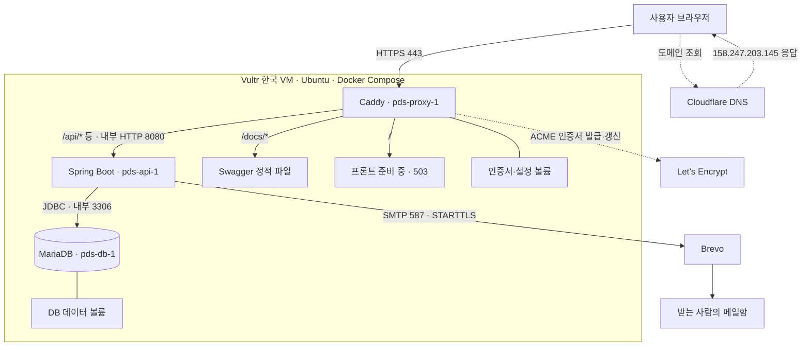

# 09 · 배포 과정과 면접 설명 — Docker·Caddy·HTTPS

<mention-page url="https://app.notion.com/p/3d50def9f6268037adfbcef233c6d20c">플랜두씨 다이어리</mention-page>
기준: 2026-09-08 실제 배포 기록. 이 문서는 이번에 무엇을 했는지 이해하고 면접에서 설명하기 위한 안내서다. 설계 의도, 실제 확인, 앞으로 할 일을 구분한다. 처음에는 1\~3절과 7절을 읽고, 이후 과정과 예상 질문을 따라가면 된다.
<table_of_contents/>
## 1. 먼저 세 가지를 구분하기
**Caddy(캐디)는 우리 서버에서 웹 요청을 받는 프로그램이다. Let’s Encrypt(렛츠 인크립트)는 HTTPS에 쓸 인증서를 발급하는 기관이다. Nginx(엔진엑스)는 Caddy와 비슷한 역할을 할 수 있는 다른 웹 서버다.** 이번에는 Caddy를 사용했고 Nginx·Certbot은 사용하지 않았다.
HTTPS는 HTTP 통신에 TLS 보호를 더한 것이다. 브라우저는 인증서의 이름·유효 기간·신뢰 관계를 확인하고 서버와 암호화 통신을 한다. 인증서가 있다고 서비스의 모든 버그나 접근 권한 문제가 해결되는 것은 아니다. 로그인·권한 검사는 별도로 필요하다.
Let’s Encrypt는 도메인을 제어한다는 사실을 확인한 뒤 인증서를 발급한다. 서버 쪽에서 이 발급 절차를 요청하는 프로그램을 ACME 클라이언트라고 한다. 이번에는 Caddy가 그 역할까지 맡았다. [Let’s Encrypt의 발급 과정](https://letsencrypt.org/how-it-works/)
<table header-row="true">
<tr>
<td>이름</td>
<td>하는 일</td>
<td>이번 프로젝트</td>
</tr>
<tr>
<td>Caddy</td>
<td>웹 요청 수신, 내부 API로 전달, 정적 파일 제공, 인증서 관리</td>
<td>사용</td>
</tr>
<tr>
<td>Nginx</td>
<td>웹 서버·리버스 프록시로 사용할 수 있는 대안</td>
<td>미사용</td>
</tr>
<tr>
<td>Let’s Encrypt</td>
<td>도메인 검증 후 신뢰할 수 있는 TLS 인증서 발급</td>
<td>Caddy가 발급받음</td>
</tr>
<tr>
<td>Certbot</td>
<td>Let’s Encrypt 인증서의 발급·적용·갱신을 도와주는 도구</td>
<td>미사용. Caddy에 필요한 기능이 내장됨</td>
</tr>
</table>
“Nginx + Certbot”은 가능한 구성 예다. 이번 구성은 “Caddy + Let’s Encrypt”다. Nginx가 있어야 HTTPS를 사용할 수 있는 것도, Let’s Encrypt가 웹 요청을 대신 처리하는 것도 아니다. [Nginx 리버스 프록시](https://docs.nginx.com/nginx/admin-guide/web-server/reverse-proxy/) · [Certbot 설명](https://certbot.eff.org/pages/about)
## 2. 이번에 만든 구조를 그림으로 보기
**현재 동작하는 것은 DB·백엔드·API 문서다. 사용자용 프론트 화면은 아직 없다.**

점선 DNS 조회와 실선 웹 요청은 다른 흐름이다. 현재 Cloudflare는 DNS only이므로 브라우저의 웹 요청은 Vultr의 Caddy에 직접 도착한다. Let’s Encrypt도 일반 API 요청의 중간 서버가 아니다. [Cloudflare DNS only와 프록시의 차이](https://developers.cloudflare.com/dns/proxy-status/)
예를 들어 사용자가 `/api/v1/meta`를 요청하면 Caddy가 TLS 연결을 처리하고 내부의 `api:8080`으로 요청을 전달한다. Spring이 서비스 정보를 JSON으로 돌려주면 Caddy가 브라우저에 반환한다. 데이터 조회·수정 API에서는 Spring이 MariaDB에 필요한 쿼리를 실행한다. DNS는 `/api/...` 같은 경로를 보고 요청을 나누지 않는다.
리버스 프록시는 이처럼 외부 요청을 먼저 받은 뒤 적절한 내부 서버로 전달하는 역할이다. 이번에는 Caddy가 그 역할과 Swagger 파일 제공을 함께 맡는다. 내부 `api:8080`은 같은 Docker 네트워크의 서비스 이름이다. Caddy 컨테이너에서 `localhost`를 쓰면 Caddy 자신의 컨테이너를 가리키므로 API 목적지로 쓰지 않았다.
## 3. 용어를 실제 구성에 연결하기
<table header-row="true">
<tr>
<td>용어</td>
<td>쉽게 설명하면</td>
<td>우리 구성</td>
</tr>
<tr>
<td>VPS / VM</td>
<td>클라우드에서 빌린 독립 서버 환경</td>
<td>Vultr 한 대. 8 vCPU·약 16GB RAM·350GiB 디스크</td>
</tr>
<tr>
<td>Ubuntu</td>
<td>서버에서 프로그램을 실행하는 운영체제</td>
<td>26.04.1 LTS, x86_64</td>
</tr>
<tr>
<td>SSH</td>
<td>서버에 안전하게 접속해 관리하는 통로</td>
<td>linuxuser와 장치의 SSH 키 사용. 관리 포트 22</td>
</tr>
<tr>
<td>DNS / A 레코드</td>
<td>도메인 이름을 IPv4 주소에 연결하는 정보</td>
<td>[plandosee.app](http://plandosee.app) → 158.247.203.145</td>
</tr>
<tr>
<td>포트</td>
<td>한 서버에서 어떤 서비스에 연결할지 구분하는 번호</td>
<td>웹 80/443, 내부 API 8080, 내부 DB 3306</td>
</tr>
<tr>
<td>이미지</td>
<td>프로그램과 실행에 필요한 파일을 묶은 실행 재료</td>
<td>Java 21 런타임과 백엔드를 묶은 linux/amd64 이미지</td>
</tr>
<tr>
<td>컨테이너</td>
<td>이미지로 실행한 격리된 프로세스 환경</td>
<td>DB·API·Caddy를 각각 실행</td>
</tr>
<tr>
<td>Docker Compose</td>
<td>여러 컨테이너의 설정과 연결을 파일로 정의하는 도구</td>
<td>compose.yaml에 서비스·네트워크·볼륨·실행 순서 정의</td>
</tr>
<tr>
<td>볼륨</td>
<td>컨테이너와 별개로 데이터를 보관하는 저장 공간</td>
<td>DB 데이터와 Caddy 인증서 보관. 그 자체가 외부 백업은 아님</td>
</tr>
<tr>
<td>Flyway</td>
<td>DB 구조 변경 SQL의 적용 순서와 이력을 관리하는 도구</td>
<td>V1\~V3를 별도 migration 작업으로 적용</td>
</tr>
<tr>
<td>OpenAPI / Swagger UI</td>
<td>API 계약 문서 / 그 문서를 읽기 편하게 보여 주는 화면</td>
<td>42개 경로·59개 작업·38개 모델을 /docs/에서 제공</td>
</tr>
</table>
컨테이너마다 Ubuntu 전체를 새로 부팅하는 구조가 아니다. 같은 호스트의 커널을 공유하면서 프로세스 환경을 분리한다. Compose로 여러 컨테이너를 실행해도 VM 한 대가 두 대가 되지는 않는다. 서버 한 대의 장애는 전체 서비스에 영향을 줄 수 있다. [Docker 컨테이너](https://docs.docker.com/get-started/docker-concepts/the-basics/what-is-a-container/) · [Compose 구성 요소](https://docs.docker.com/compose/intro/compose-application-model/)
## 4. 왜 이렇게 선택했는가
사용자가 확정한 조건은 초기 이용자 약 10명, 클라우드에서 먼저 시작, 이후 WTR Pro로 이전, MariaDB 유지, Brevo SMTP 사용, 소셜 외부 설정은 프론트 완성 후 진행이다. Vultr 선택과 한 달 안에 이전할 것이라는 예상도 사용자 결정이다. 정확한 이전일·크레딧 만료는 확인되지 않았다.
<table header-row="true">
<tr>
<td>구성</td>
<td>선택을 설명할 근거</td>
<td>함께 설명할 한계</td>
</tr>
<tr>
<td>단일 VM + Compose</td>
<td>현재 배포할 서비스를 한 곳에서 관리하고 이후 동일한 구성으로 이전하기 위한 구조</td>
<td>고가용성 구성이 아니다. 10명에 필요한 최소 사양을 부하 시험으로 산정한 것도 아니다</td>
</tr>
<tr>
<td>Caddy</td>
<td>리버스 프록시와 자동 HTTPS를 함께 구성해 인증서 운영 절차를 줄이는 선택</td>
<td>Nginx보다 빠르다는 성능 비교를 수행한 것은 아니다</td>
</tr>
<tr>
<td>클라우드 독립적인 이미지와 DB 덤프</td>
<td>Vultr 전용 관리형 서비스에 데이터·실행 방식을 강하게 묶지 않고 WTR 이전 준비</td>
<td>실제 WTR 설치·외부 접속·복원은 아직 검증 전</td>
</tr>
<tr>
<td>Brevo SMTP</td>
<td>애플리케이션이 외부 메일 발송 서비스에 전달하도록 역할 분리</td>
<td>네이버 시험 1통의 수신은 확인했지만 모든 메일의 받은편지함 도착을 보장하지 않음</td>
</tr>
<tr>
<td>Jib로 로컬 이미지 생성</td>
<td>Java 앱을 linux/amd64 이미지로 만들어 서버에 완성물을 전달</td>
<td>이번에는 로컬 작업 파일에서 빌드했다. 자동 CI/CD나 Git 커밋 기반 배포는 아직 아님</td>
</tr>
</table>
이는 현재 구성의 설계 이유다. 면접에서 자신의 판단을 설명할 때는 실제로 선택한 조건과 AI의 제안·실행 지원을 구분한다. 수행하지 않은 성능 비교나 독자 설계를 했다고 덧붙일 필요는 없다.
## 5. 실제 배포는 어떤 순서로 진행했는가
아래는 이미 수행한 배포의 복기다. 처음부터 설치하는 절차와 운영 중인 서버를 갱신하는 절차는 다르다. 초기 배포 스크립트는 기존 `.env`나 `secrets`가 있으면 중단하도록 작성했다.
### ① 대상 서버와 관리 접속 확인
처음 사용자 화면에서 서버 위치가 Chicago로 확인됐다. 사용자가 새 서버를 만들었고 이전 Chicago 서버는 직접 삭제했다고 알려 주었다. 새 서버의 IP는 `158.247.203.145`다. SSH로 읽은 메타데이터에서 한국 리전 `kr`을 확인했다. 서울을 목표로 선택했지만 새 서버 콘솔의 정확한 도시 표시는 별도로 읽지 않았다.
Vultr 콘솔에서 확인한 SSH 호스트 키 지문과 접속 대상의 지문을 대조했다. 호스트 키는 “내가 접속한 서버가 맞는가”를 확인하고, 사용자의 개인키는 “이 사용자가 접속할 권한이 있는가”를 증명한다. 두 키의 역할이 다르다. Windows 개인키 접근 권한 문제는 사용자 승인 후 기존 키의 소유자·접근 권한을 정리해 해결했고, 개인키를 다른 곳으로 복사하지 않았다.
### ② Ubuntu에 Docker와 Compose 설치
운영체제·CPU 구조·메모리·디스크·sudo 가능 여부를 먼저 확인했다. 이후 공식 패키지 경로로 Docker 29.8.0과 Compose 5.5.1을 설치했다. Docker 서비스의 실행·부팅 시 시작 설정과 hello-world 실행을 확인했다. 전체 OS 업그레이드나 재부팅까지 완료했다고 기록하지는 않았다.
관련 파일: 인프라 `scripts/host-preflight.sh`, `scripts/bootstrap-docker.sh`. 이 단계의 성공은 컨테이너 실행 환경이 준비됐다는 뜻이며, 아직 애플리케이션 배포 성공은 아니다.
### ③ 백엔드를 Linux 이미지로 빌드
로컬 PC에서 Java 21·Spring Boot 4.1.1 백엔드를 Jib Gradle 3.5.4로 빌드했다. 목표는 `linux/amd64`이며 Java 런타임 기반 이미지도 digest로 고정했다. Jib는 Java 앱을 컨테이너 이미지로 만들 수 있고, 이번에는 `jibBuildTar`로 이미지 tar 파일을 만들었다. [Jib 공식 안내](https://github.com/GoogleContainerTools/jib/tree/master/jib-gradle-plugin)
Windows 빌드 PC에서 사용한 프로젝트 명령:
```powershell
# D:\workspace\PDC_Diary_Spring에서 실행한 이미지 빌드
.\scripts\build.ps1 -Tasks jibBuildTar
```
결과 파일은 백엔드의 `build/jib-image.tar`다. Dockerfile을 운영 서버에서 다시 빌드한 것이 아니라, 완성된 tar를 SSH 기반 파일 전송으로 보냈다. 로컬과 서버의 SHA-256을 비교한 뒤 이미지를 로드했다. SHA-256 대조는 두 파일의 내용이 같은지 확인하는 절차이며, 코드의 안전성을 증명하는 검사는 아니다.
이미지 이름의 태그만 기록하지 않고 실제 digest를 배포 증거에 남겼다. 당시 Jib가 내놓은 config ID와 Docker 29 서버의 이미지 ID가 달라 첫 대조에서 멈췄고, 서버에서 실제 manifest digest와 이미지 ID를 대조해 진행했다. 자세한 값은 검증 JSON에 있으며 면접에서는 긴 해시를 외울 필요가 없다.
### ④ 서버에 실행 설정과 비밀값을 분리
운영 경로는 `/opt/pds`다. Compose·Caddy 설정·배포 스크립트를 두고, 비밀번호·SMTP 키는 별도 비밀 파일로 관리했다. 서버 비밀 디렉터리는 root 전용 700, 파일은 600으로 설정했다. 로컬 `.env.brevo.local`과 SSH 개인키는 Git 제외 대상이다. 비밀값 자체는 이 설명서·노션에 넣지 않는다.
Compose의 API 환경 파일은 `format: raw`로 읽게 하여 값 안의 문자가 Compose 변수 치환으로 바뀌지 않도록 했다. API는 root가 아닌 UID/GID 10001, 읽기 전용 파일시스템, 임시 쓰기 공간, 불필요한 권한 제거, 1536MiB 메모리 제한으로 실행했다. 이것이 모든 보안 검증의 완료를 뜻하지는 않는다.
### ⑤ MariaDB부터 시작하고 migration 적용
MariaDB가 healthy인지 확인한 뒤 DB 구조를 준비했다. 순서는 DB 시작 → migration 계정 준비 → 별도 migration 작업으로 Flyway V1\~V3 적용 → 실행 계정 권한 부여 → API 시작이다. `depends_on`만 적고 끝낸 것이 아니라 healthcheck 조건과 이후 API 상태 응답도 확인했다.
`pds_migration`은 전용 DB 구조를 변경하는 역할, `pds_app`은 API 실행에 필요한 조회·표별 쓰기 역할로 분리했다. API의 일반 기동에서는 Flyway 자동 실행을 껐다. 앱을 재시작할 때마다 구조 변경 권한으로 실행하지 않기 위한 구성이다. DB root는 별도로 남는다.
서버에서 MariaDB 12.3.3, V1\~V3 성공, 21개 표·131개 열을 확인했다. 이 숫자는 구조 관측 결과다. 모든 열·제약·실제 사용자 자료에 대한 최종 인수 검증을 대신하지 않는다. 사용자 PC의 기존 MariaDB 포트 3919는 변경하지 않았고, 컨테이너끼리는 내부 `db:3306`을 사용한다.
관련 파일: 인프라 `scripts/deploy-initial-backend.sh`, `scripts/provision-db.sh`, 백엔드 `src/main/resources/db/migration/`.
### ⑥ API 내부 상태와 접근 경계 점검
내부 API 점검 15개가 통과했다. 상태 UP, 서비스 메타데이터, 공개 목록 200, 로그인하지 않은 개인 목록 401, CSRF 없는 변경 403, 유효한 CSRF와 잘못된 입력의 400 등을 확인했다. 실제 계획·할 일·실행 기록은 만들지 않았다.
이 단계는 서버 내부 통신 검사다. 내부에서 정상이어도 외부 DNS·인증서·프록시가 잘못되면 사용자는 접속할 수 있으므로 뒤에서 공개 HTTPS를 따로 검사했다.
### ⑦ Caddy를 앞에 두고 경로 연결
DB·API 초기화 후 Caddy 컨테이너를 실행했다. Caddy는 외부 80/443을 받으며 `/api/*`, `/oauth2/*`, `/login/oauth2/*`를 API에 전달한다. `/docs/*`는 Swagger 파일을 직접 제공한다. `/docs`는 `/docs/`로 이동시킨다. 프론트가 없으므로 나머지 경로는 준비 중 문구와 503을 반환하도록 명시했다.
외부에 API 8080과 DB 3306을 호스트 포트로 공개하지 않았다. Compose에서 외부 웹에 공개한 것은 TCP 80/443과 UDP 443이다. 관리자 SSH 22는 별도다. 실제 Vultr 방화벽 그룹의 전체 규칙을 읽거나 점검한 것은 아니므로 “방화벽까지 완전히 감사했다”고 설명하지 않는다.
### ⑧ 복원과 이메일을 별도로 확인
DB를 덤프한 뒤 같은 서버의 새 임시 스키마에 복원했다. 21개 표의 행 수와 전체 행 체크섬을 비교해 일치를 확인했다. 기존 운영 스키마를 지우거나 그 위에 복원하지 않았다. 같은 서버에 남긴 덤프는 서버 자체 장애에 대비한 외부 백업이 아니다.
Brevo는 발신 도메인이 Authenticated라는 사용자 확인을 받았다. 서버에서 SMTP 587에 STARTTLS로 접속·인증해 시험 메일 한 통을 전송했고, Spring의 SMTP 상태 검사도 성공했다. “발송 요청 접수” 뒤 사용자가 네이버 받은편지함 수신까지 확인했다. 시험 발송은 같은 서버·자격을 사용한 Python SMTP였으며, 회원가입·비밀번호 재설정 전체 화면 동선을 끝까지 검증한 것은 아니다.
메일 발신 도메인 인증과 HTTPS 인증서는 목적이 다르다. 전자는 메일 발신 설정에 관한 것이고, 후자는 웹 연결의 도메인 신뢰와 TLS에 관한 것이다. n8n은 이번 인증 메일 전달 경로에 포함되지 않았다.
### ⑨ DNS 오류 수정 후 정식 HTTPS 확인
처음 A 레코드는 `pdcvultr.plandosee.app`에만 등록돼 있었다. Caddy가 인증서를 요청하는 이름은 `plandosee.app`이었으므로 이름이 달랐다. 두 주소를 구분해 조회한 결과 하위 주소에는 IP가 있고 기본 주소에는 A 응답이 없음을 확인했다.
사용자가 Cloudflare의 이름을 `@`로 바꾼 뒤 두 권한 DNS 서버에서 기본 도메인의 `158.247.203.145` 응답을 확인했다. Caddy는 자동 재시도로 정식 Let’s Encrypt 인증서를 발급받았다. 성공 로그에는 `tls-alpn-01` 도메인 검증과 정식 발급 기관의 성공 응답이 있었다. 서버 재시작·인증서 검사 해제 없이 해결됐다.
### ⑩ 실제 도메인으로 최종 외부 점검
2026-09-08 19:37:45 한국 시각, 실제 도메인과 인증서 신뢰 검증을 유지한 외부 점검 29개가 통과했다. DNS 강제 지정이나 인증서 오류 무시는 사용하지 않았다. Swagger 6개 파일은 로컬 파일과 해시가 일치했고 브라우저에서 실제 표시도 확인했다.
배포 후 결과: [Swagger / API 문서](https://plandosee.app/docs/) · [API 메타데이터](https://plandosee.app/api/v1/meta). 기본 주소 `/`의 503은 프론트 미구현을 알리기 위한 현재 설정이다. 일반적으로 503이 언제나 정상이라는 뜻은 아니다.
## 6. Caddy 설정과 HTTPS가 이어지는 방식
실제 운영 설정에서 핵심만 발췌하면 다음과 같다. 운영 전체 파일에는 헤더·요청 크기 제한·프록시 헤더 처리 등도 포함되므로 이 발췌본으로 덮어쓰지 않는다.
```plain text
{$DOMAIN} {
    redir /docs /docs/ 308
    handle_path /docs/* {
        root * /srv/api-docs
        file_server
    }
    @api path /api/* /oauth2/* /login/oauth2/*
    handle @api {
        reverse_proxy api:8080
    }
    handle {
        respond "Web deployment is pending." 503
    }
}
```
`DOMAIN`에는 `plandosee.app`이 전달된다. Caddy는 이 도메인에 대한 인증서를 자동으로 관리하고 HTTP 요청을 HTTPS로 이동시킨다. `/docs/openapi.json`은 경로 앞부분 `/docs`를 제거한 뒤 `/srv/api-docs/openapi.json` 파일에서 제공한다. API 요청은 경로를 유지해 Spring으로 전달한다.
인증서 발급 때에는 Caddy가 도메인 검증 요청에 응답할 수 있어야 한다. 우리 구성에서는 DNS가 서버 IP를 가리키고 80/443에 외부 연결이 가능해야 한다. Caddy의 인증서 저장 공간 `/data`는 볼륨으로 유지했다. 자동 갱신 기능은 구성돼 있지만 미래의 실제 갱신이 이미 성공했다고 주장하지 않는다. [Caddy 자동 HTTPS와 검증 조건](https://caddyserver.com/docs/automatic-https)
브라우저에서 Caddy까지는 HTTPS, 같은 VM 안의 Caddy에서 API까지는 Docker 내부 HTTP다. TLS가 끝나는 지점이 Caddy라는 의미로 “TLS 종료”라고 부른다. 내부 HTTP까지 암호화됐다고 설명하면 안 된다. 여러 서버·네트워크로 분리하는 경우 내부 통신 보호도 다시 검토할 항목이다.
## 7. 면접에서 설명하기 좋은 장애 사례
### DNS 이름 불일치: 증거를 비교해 원인을 좁힌 사례
<table header-row="true">
<tr>
<td>단계</td>
<td>실제로 확인한 내용</td>
</tr>
<tr>
<td>증상</td>
<td>내부 API는 정상인데 공개 HTTPS 인증서 발급이 실패했다</td>
</tr>
<tr>
<td>로그</td>
<td>[plandosee.app](http://plandosee.app)에 유효한 A/AAAA가 없다는 ACME 오류</td>
</tr>
<tr>
<td>최소 비교</td>
<td>기본 도메인과 pdcvultr 하위 도메인의 A 응답을 같은 권한 DNS에서 비교</td>
</tr>
<tr>
<td>관찰</td>
<td>하위 도메인만 서버 IP가 있었고, 기본 도메인은 A 응답 없이 SOA만 반환</td>
</tr>
<tr>
<td>변경</td>
<td>사용자가 A 레코드 이름을 @로 수정</td>
</tr>
<tr>
<td>재검증</td>
<td>권한 DNS 두 곳에서 IP 확인 → Caddy 정식 인증서 발급 → 공개 HTTPS 검사 통과</td>
</tr>
</table>
여기서 SOA 응답은 도메인 전체가 존재하지 않는다는 뜻으로 단정하지 않는다. 요청한 A 응답이 없었다는 관찰이 중요하다. DNS 전파 지연이나 방화벽 문제를 먼저 단정하지 않고, 실제 등록된 이름과 요청한 이름을 비교해 구분했다.
Cloudflare의 “Proxying is required…” 배너는 보안·캐시 기능을 쓰려면 프록시를 켜라는 안내였다. DNS only 상태 자체가 HTTPS를 막은 것은 아니다. 실제로 DNS only를 유지한 채 이름만 수정하자 인증서 발급이 성공했다. `@`는 기본 도메인을 지정하는 Cloudflare의 표기다. [기본 도메인 레코드](https://developers.cloudflare.com/dns/concepts/)
### 복원 검사의 빈틈: 성공 메시지의 범위를 확인한 사례
처음 복원 스크립트는 표 목록을 표준입력으로 읽는 반복문 안에서 다른 Docker 명령도 같은 표준입력을 읽었다. 그 결과 1개 표만 비교하고 끝나는 문제가 있었다. 표 목록을 먼저 배열로 읽고, 전체 표 개수와 비교 완료 개수가 같아야 통과하도록 수정했다. 이후 21개 표 전체의 행 수·체크섬 일치를 재확인했다.
이 사례의 설명 포인트는 “백업 명령이 종료됐다”와 “복원된 전체 데이터가 비교됐다”를 구분했다는 점이다. 그래도 아직 같은 서버의 초기 데이터 복원 검사이므로 대용량 운영 데이터·외부 백업·WTR 복원을 보장하는 증거는 아니다.
## 8. 무엇을 검증했고 무엇은 남았는가
<table header-row="true">
<tr>
<td>검증 범위</td>
<td>실제 결과</td>
<td>이것만으로 말할 수 없는 것</td>
</tr>
<tr>
<td>로컬 백엔드 시험</td>
<td>통합 12개 + 경계 2개 통과</td>
<td>운영 브라우저의 모든 기능이 정상이라는 결론</td>
</tr>
<tr>
<td>서버 내부 점검</td>
<td>15개 통과, DB·API 상태 확인</td>
<td>외부 DNS·HTTPS까지 정상이라는 결론</td>
</tr>
<tr>
<td>공개 HTTPS 점검</td>
<td>29개 통과, 인증서·상태 코드·쿠키·문서 파일 대조</td>
<td>59개 API 모두에 대한 완전한 운영 기능 시험</td>
</tr>
<tr>
<td>API 문서</td>
<td>42개 경로·59개 작업·38개 모델, 예시 43개 검사와 소스 대조</td>
<td>Swagger 항목 수가 실제 테스트 통과 수라는 해석</td>
</tr>
<tr>
<td>메일</td>
<td>SMTP 접수·Spring 상태 UP·네이버 받은편지함 수신</td>
<td>모든 제공자 전달률이나 가입·재설정 전체 동선 완료</td>
</tr>
<tr>
<td>DB 복원</td>
<td>같은 서버의 임시 스키마에서 21개 표 행 수·체크섬 일치</td>
<td>서버 장애를 견디는 외부 백업과 NAS 이전 완료</td>
</tr>
<tr>
<td>보안</td>
<td>DB/API 호스트 포트 비공개, 비밀 파일 권한, 비특권 API·쿠키·CSRF 일부 검사</td>
<td>방화벽 전체 감사·전체 Git 이력 비밀값 검사·보안 인증 완료</td>
</tr>
</table>
남은 일은 사용자용 프론트 구현·배포, 이메일 인증 전체 동선, 카카오·네이버·구글 외부 연동, 외부 암호화 백업과 복구, WTR 이전 검증, 전체 과제 인수와 실제 사용자 자료 확인이다. CI/CD·공개 이미지 레지스트리·Git 커밋에 연결된 최종 릴리스도 이번 배포에는 없다.
## 9. 면접에서 말하는 1분 설명
다음은 확인된 범위만 담은 말하기 예시다. 그대로 외우기보다 각 문장의 근거를 앞 절에서 찾아 자신의 표현으로 바꾼다.
> 초기에는 클라우드에서 운영하고 이후 개인 서버로 옮길 수 있도록, Vultr의 Ubuntu 서버 한 대에 Docker Compose로 Spring Boot와 MariaDB, Caddy를 구성했습니다. 백엔드 이미지는 로컬에서 Jib로 만들고 전송 전후 해시를 비교했습니다. DB 구조 변경은 Flyway 전용 작업과 계정으로 분리했습니다. Caddy가 외부 HTTPS를 받고 내부 API로 전달하며, Let’s Encrypt 인증서를 자동으로 관리합니다. 처음에는 DNS가 하위 도메인에만 등록되어 인증서 발급이 막혔는데, 기본 도메인과 하위 도메인의 응답을 비교해 이름 불일치를 확인했고 수정 후 정상 발급됐습니다. 현재 공개 API와 Swagger, SMTP 시험수신을 확인했으며, 프론트와 외부 백업·소셜 연동은 후속 과제입니다. 구성과 검증에는 AI의 도움을 받았고, 서비스 조건과 제공자 선택, 서버 생성·DNS 변경은 직접 진행했습니다.
## 10. 예상 질문과 답변 연습
### Nginx는 어디에 쓰셨나요?
이번 배포에는 Nginx를 사용하지 않았습니다. 같은 위치의 웹 서버·리버스 프록시 역할을 Caddy가 수행합니다. 자동 HTTPS를 함께 구성할 수 있어 선택했으며 두 제품의 성능을 비교 측정한 것은 아닙니다.
### Let’s Encrypt는 서버에 설치한 프로그램인가요?
인증서를 발급하는 기관입니다. 우리 서버에서는 Caddy가 ACME 클라이언트로 요청하고 도메인 검증에 응답했습니다. 발급된 인증서를 Caddy가 TLS 연결에 사용합니다.
### HTTPS가 되면 로그인도 안전한가요?
전송 구간 보호와 앱의 권한 검사는 별개입니다. 이번에는 세션 쿠키의 Secure·HttpOnly·SameSite 설정과 CSRF 검사, 익명 사용자의 개인 API 거부를 따로 확인했습니다. 전체 로그인 화면 동선 검증은 남았습니다.
### DB도 인터넷에서 접속할 수 있나요?
운영 DB 3306과 API 8080은 호스트에 공개하지 않았습니다. 같은 Docker 네트워크의 서비스 이름으로 연결합니다. 개발 PC의 MariaDB 3919와 운영 내부 포트는 서로 다른 환경입니다.
### 왜 Kubernetes를 쓰지 않았나요?
현재 구성은 단일 VM의 소규모 초기 배포와 이전 준비를 위한 Compose입니다. 다중 노드 운영이나 자동 확장 요구를 실제로 검증한 단계가 아니므로, 분산 운영 시스템을 구축했다고 설명하지 않습니다. Kubernetes와의 비용·성능 비교 시험도 하지 않았습니다.
### 서버를 옮길 때 무엇을 가져가나요?
앱 이미지와 Compose·Caddy 설정, 운영 비밀값, MariaDB 데이터 덤프를 준비해야 합니다. 목표 서버에서 복원을 먼저 시험하고 쓰기를 멈춘 상태의 최종 데이터를 옮긴 다음, 확인 후 DNS를 새 주소로 전환하는 계획입니다. 현재 WTR에서 실제로 끝낸 과정은 아닙니다.
### 배포가 잘됐다는 것을 어떻게 확인했나요?
프로세스 기동, DB 상태, 내부 API, 외부 HTTPS, 문서의 브라우저 표시, 메일 접수와 실제 수신을 나눠 확인했습니다. 정상 응답뿐 아니라 개인 API 401, CSRF 없는 변경 403처럼 기대한 거부도 확인했습니다. 운영 모든 기능의 최종 합격으로 확대해 해석하지 않았습니다.
### AI를 사용했다면 본인이 한 일은 무엇인가요?
대화로 확인된 본인 역할은 공개·개인 영역 요구 결정, 클라우드·이전 방향 결정, Vultr 서버 생성과 잘못 만든 서버 삭제, DNS 설정·수정, Brevo 발신 도메인 준비, 시험 메일 수신 확인입니다. AI는 구성·스크립트·이미지 빌드·배포·검증·문서화를 지원했습니다. 지금 공부하는 부분까지 과거에 혼자 구현·이해했다고 표현하지 않고, 설명할 수 있게 된 원리와 직접 확인한 증거로 답하면 됩니다.
## 11. 혼자 확인할 때 보는 명령과 파일
아래 명령은 현재 배포의 상태를 읽는 용도다. 처음 설치하는 전체 명령 묶음은 아니다.
Windows PC에서 도메인과 공개 응답 확인:
```powershell
Resolve-DnsName plandosee.app -Type A -Server aleena.ns.cloudflare.com -DnsOnly
curl.exe -I https://plandosee.app/docs/
curl.exe https://plandosee.app/api/v1/meta
```
SSH로 서버에 접속한 뒤 컨테이너 상태와 최근 Caddy 로그 확인:
```bash
cd /opt/pds
sudo docker compose ps
sudo docker compose logs --tail=80 proxy
sudo docker compose config --quiet
```
성공 기준은 A 레코드가 목표 IP를 반환하고, Swagger가 HTTPS 200으로 열리며, 컨테이너가 실행 중이고 DB가 healthy인 것이다. `config --quiet`는 설정 파싱 검사일 뿐 실제 서비스 성공을 대신하지 않는다. 로그를 외부에 공유할 때에는 비밀값·개인 자료가 없는 범위만 사용한다.
<table header-row="true">
<tr>
<td>알고 싶은 것</td>
<td>구상 저장소 기준 근거 파일</td>
</tr>
<tr>
<td>현재 배포 상태와 한계</td>
<td>docs/[deployment-status.md](http://deployment-status.md)</td>
</tr>
<tr>
<td>서버 준비 단계의 당시 증거</td>
<td>PDC_Diary_Spring/ops/releases/host-bootstrap-verification.json</td>
</tr>
<tr>
<td>이미지·DB·SMTP·복원 증거</td>
<td>PDC_Diary_Spring/ops/releases/deployment-verification.json</td>
</tr>
<tr>
<td>공개 HTTPS 29개 점검</td>
<td>PDC_Diary_Spring/ops/releases/public-https-verification.json</td>
</tr>
<tr>
<td>컨테이너·네트워크·볼륨 설정</td>
<td>PDC_Diary_Spring/ops/compose.yaml</td>
</tr>
<tr>
<td>실제 Caddy 라우팅</td>
<td>PDC_Diary_Spring/ops/caddy/backend.Caddyfile</td>
</tr>
<tr>
<td>첫 DB/API 배포 순서</td>
<td>PDC_Diary_Spring/ops/scripts/[deploy-initial-backend.sh](http://deploy-initial-backend.sh)</td>
</tr>
<tr>
<td>복원 대조와 외부 HTTPS 검사</td>
<td>scripts/[verify-initial-restore.sh](http://verify-initial-restore.sh), scripts/verify-public-https.mjs — Spring ops 내부</td>
</tr>
<tr>
<td>OpenAPI 원본·소스 대조 정보</td>
<td>contracts/openapi.json, contracts/api-publication.json</td>
</tr>
</table>
시점이 다른 파일을 읽을 때는 주의한다. host-bootstrap 기록의 “아직 앱 배포 전”은 Docker 설치 직후의 사실이다. 최종 상태는 후속 deployment·public-https 증거를 함께 읽는다. 원문 44개 과제 조건과 API·DB 구조 계약은 이 학습 문서를 만들면서 바꾸지 않았다.
## 12. 면접 전에 스스로 설명해 보기
아래 질문을 문서 없이 답한 뒤 해당 절과 대조한다. 답을 외우기보다 요청이 지나가는 위치를 그림으로 설명하는 것을 목표로 한다.
1. 브라우저가 도메인을 입력한 순간부터 Spring 응답을 받기까지 DNS·Caddy·API는 각각 무엇을 하는가?
2. Caddy, Nginx, Let’s Encrypt, Certbot 중 이번에 실제 사용한 것은 무엇인가?
3. 하위 도메인 A 레코드가 있는데도 기본 도메인의 인증서를 받지 못한 이유는 무엇인가?
4. 내부 API 200과 외부 HTTPS 200을 왜 따로 확인했는가?
5. Docker 볼륨 유지와 외부 백업은 무엇이 다른가?
6. 확인한 내용과 아직 하지 않은 내용을 각각 두 가지씩 말할 수 있는가?
실제 운영·비용 기록은 <mention-page url="https://app.notion.com/p/3d50def9f62681adb938f61a437009d5"/>에서 이어서 볼 수 있다.
