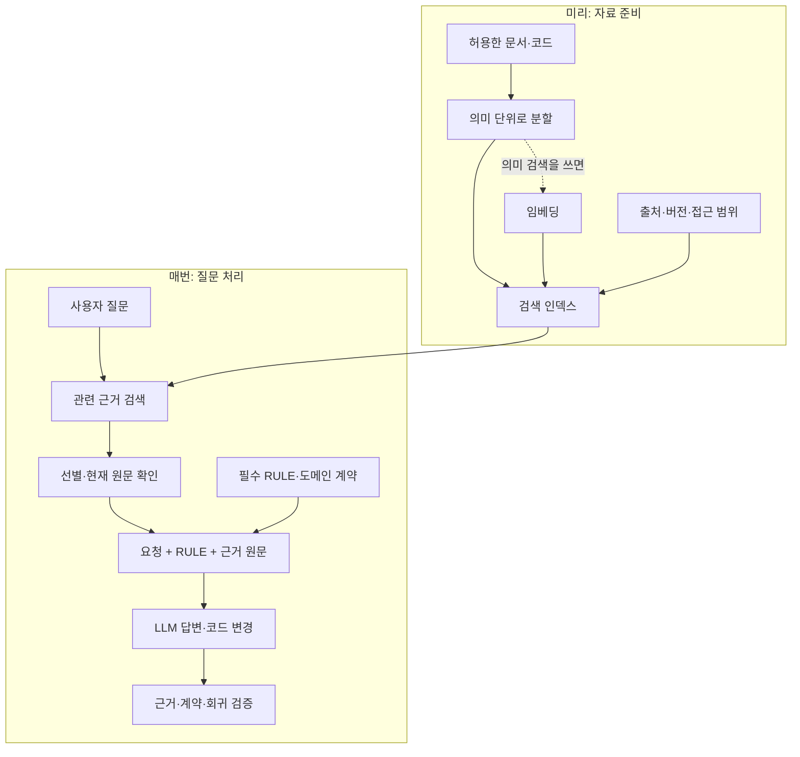

# RAG — 필요한 근거를 찾아 읽고 답하기

2026-09-09 · 개념 학습 및 프로젝트 적용 제안. RAG 구축이나 도구 선정이 완료된 상태는 아니다.

> **RAG = 질문과 관련된 자료를 검색하고, 그 원문을 LLM에게 함께 주는 방식.**
> 일반적인 RAG는 모델의 가중치를 다시 학습시키지 않는다. 사람이 매번 파일을 고르는 작업은 검색 도구로 자동화할 수 있다.

## HTML 지식그래프

[노션 RAG 학습 페이지](https://app.notion.com/p/3d40def9f626816ab473d0eb05d73ef1) 상단에 HTML 임베드로 삽입했다. 원본: [rag-knowledge-graph.html](rag-knowledge-graph.html)

**사용법:** `상호 작용`을 누른 뒤 한눈에 / 자료 준비 / 질문 처리 / 프로젝트 연결을 선택한다. 노드를 누르면 아래 설명과 연결이 바뀐다. 더 크게 보려면 그래프 우측 상단의 전체화면 버튼을 누른다.

## 1. 전체 흐름

자료를 미리 준비하는 과정과, 질문할 때 근거를 찾는 과정으로 나뉜다.



**벡터는 자료를 찾는 용도다. LLM이 읽는 것은 검색된 본문이다.** 검색 인덱스는 본문 또는 원문 참조와 검색 정보를 보관한다.

## 2. 핵심 용어

| 용어 | 무엇을 하나 |
| --- | --- |
| 청크 | 긴 자료를 문서의 절·함수·API 단위로 나눈 조각 |
| 임베딩 | 문서와 질문의 의미를 비교할 수 있게 만든 숫자 목록, 즉 벡터 |
| 검색 인덱스 | 조각을 빠르게 찾는 검색용 저장 구조 |
| 메타데이터 | repo·파일·구간·commit/내용 해시·상태·접근 범위 |
| 재정렬 | 검색된 후보 중 더 관련 있는 근거를 앞에 배치 |
| 문맥 | 이번 요청에서 모델에게 제공하는 지시와 근거 |
| MCP | 검색·원문 읽기 도구를 Codex 같은 클라이언트에 연결하는 규약 |

**RAG와 파인튜닝:** RAG는 요청 때 읽을 자료를 바꾼다. 파인튜닝은 학습으로 모델 가중치를 조정한다. RAG가 저장소 전체를 영구히 기억하게 만드는 것은 아니다.

## 3. 필요한 준비물

| 준비물 | 이 프로젝트에서 준비할 것 |
| --- | --- |
| ① 원본과 접근 권한 | 허용한 저장소의 문서·코드·계약·테스트 |
| ② 수집 범위 | 포함 경로, 제외 경로, Private 자료의 사용 범위 |
| ③ 수집·분할 코드 | 파일을 읽고 조각으로 나누며 제목·원문 위치 보존 |
| ④ 검색 인덱스 | 키워드 정보, 원문/참조, 메타데이터 저장 |
| ⑤ 임베딩 모델 | 의미 검색을 선택할 때 추가. 답변용 LLM과 역할이 다름 |
| ⑥ 연결 프로그램 | 요청에 맞춰 검색하고 모델에게 원문을 전달. MCP로 연결 가능 |
| ⑦ 갱신 처리 | 수정·삭제·이름 변경·브랜치 전환을 인덱스에 반영 |
| ⑧ 평가 질문 | 대표 질문과 반드시 찾아야 할 근거를 미리 정함 |

벡터 DB는 의미 검색을 구현하는 선택지다. 처음부터 별도 벡터 DB 서버가 필수인 것은 아니다. 키워드 검색만으로도 근거를 찾아 제공할 수 있다.

## 4. 실제로 사용할 때

예시 요청: **“완료 버튼을 두 번 눌렀을 때 처리를 수정해 줘.”** 아래는 설명용 흐름이며 실제 수정 결과가 아니다.

1. 공통 RULE과 완료 처리에 적용되는 도메인 계약을 읽는다.
2. 완료 API·중복 방지 제약·관련 테스트와 채택된 보안/성능 결정을 검색한다.
3. 현재 작업 버전의 원문인지 확인하고, 필요한 본문과 RULE을 모델에게 준다.
4. 모델이 코드를 수정한 뒤 중복 완료 기록과 집계를 검증한다.

| 검색 방식 | 잘 맞는 요청 |
| --- | --- |
| 키워드 | `T06-C21`, 정확한 함수 이름, API 경로 |
| 의미 | “버튼을 연속으로 눌러도 한 번만 처리”처럼 표현이 다른 요청 |
| 하이브리드 | 두 결과를 합쳐 정확한 식별자와 관련 개념을 함께 찾기 |

검색 점수와 상위 결과 개수 때문에 **필수 RULE을 누락하면 안 된다.** 필수 규칙은 지정 경로에서 읽고, 관련 자료를 검색으로 보충하도록 설계한다.

## 5. 내 저장소에 연결한다면

다음은 사용자가 알려 준 저장소 구성에 따른 연결 제안이다. 공개 범위는 제공된 화면 기준이며 이번 작업에서 다시 검사하지 않았다.

| 저장소 | RAG가 참고할 책임 범위 |
| --- | --- |
| PDC_Diary · Public | 공통 RULE·구상·채택 결정·저장소 지도 |
| PDC_Diary_Spring · Public | 백엔드 구현·API/DB 계약·migration·검사 |
| PDC_Diary_Nextjs · Public | 웹 구현·화면 흐름·상태 처리·웹 검사 |
| PDC_Diary_Security · Private | 보안 분석·설계·점검 결과와 적용 상태 |
| PDC_Diary_Optimization · Private | 성능 개선·최적화 분석과 설계, 측정 근거 |

Security/Optimization의 **제안·채택·구현·검증 상태를 구분**한다. 실제 코드와 테스트는 대상 구현 저장소에 연결한다.

추천 시작 구조:

```text
개발 PC의 허용한 저장소
  → 수집·변경 감지 → 로컬 검색 인덱스
  → 검색/원문 읽기 도구 → MCP 연결 → Codex
```

- 제품 MariaDB는 다이어리 데이터를 저장한다. 개발 보조 검색 인덱스와 역할을 분리한다.
- 초기에는 개발 PC의 도구로 시작할 수 있다. 제품 배포 서버에 RAG를 바로 올릴 필요는 없다.
- 원본과 인덱스가 로컬이어도, 클라우드 LLM에 전달한 원문은 외부로 전송된다. 외부 임베딩 API를 쓰면 그 입력도 전송된다.
- 비밀 파일·개인 기록·DB 덤프는 수집에서 제외하고, Private 자료는 권한과 허용 범위에 맞춰 검색·전달한다.

## 6. 어디부터 시작할까

**AI 추천이며 아직 확정·구축하지 않은 순서다.**

1. 정본과 필수 RULE의 위치, 저장소별 책임, 문서 상태를 정한다.
2. 키워드 검색과 원문 읽기를 연결하고 대표 질문으로 누락을 확인한다.
3. 표현 차이로 검색이 부족할 때 의미 검색·하이브리드·재정렬을 추가한다.

검색이 성공해도 모델이 잘못 해석할 수 있다. 오래된 근거·검색 누락은 원문/버전 확인과 평가 질문으로, 실제 코드 위반은 계약·회귀 검사로 확인한다.

## 현재 분량에서 RAG는 필수인가

2026-09-09 추가 검토 · **AI 판단 / 도입 결정 아님**.

로컬에서 검색된 일반 Markdown의 측정 당시 분량은 PDC_Diary 26개·178,370자, Spring 3개·7,378자, Nextjs 9개·33,221자였다. 설계+백엔드는 185,748자, 세 저장소는 218,969자다. 의존성·빌드·별도 workspaces와 기본 검색에서 제외된 파일은 제외했으며, JSON 계약·소스 코드·대화·도구 출력은 이 숫자에 포함되지 않는다. 문자 수는 토큰 수가 아니다.

2~3개 저장소를 함께 참고하는 작업에는 별도 벡터 RAG가 필수가 아니다. 현재 세션의 유효 문맥 한도와 전체 입력 토큰을 측정하지 않았으므로 모든 MD를 한 번에 넣고 작업 내내 원문 그대로 유지할 수 있다고 보장하지 않는다.

추천은 **필수 RULE·현재 설계·도메인 계약 직접 읽기 → 관련 원문 검색/재확인 → 변경 후 검사**다. 저장소/도메인별 필수 문서 경로를 정하면 벡터 DB 없이도 적용할 수 있다. 문맥 압축 후에는 필요한 원문을 다시 읽는다. [OpenAI 문맥 압축 설명](https://developers.openai.com/api/docs/guides/compaction)

RAG는 관련 원문 검색을 돕는 선택지이며 토큰 절약을 위한 필수 장치는 아니다. 전체 문서를 매번 넣는 방식보다 입력을 줄일 수 있지만, 직접 파일을 선별해 읽는 방식과 비교한 절감량은 미측정이다. 임베딩·검색·재정렬·추가 질의의 비용과 운영 부담도 생길 수 있다. 필요한 근거를 반복해서 놓치거나 찾는 시간이 커질 때 검색 평가로 도입을 판단한다.

이번에는 분량만 측정했다. 실제 누락률·토큰 비용 비교·RAG 구축은 실행하지 않았다.

## 7. 이해 확인

- **RAG를 붙이면 LLM이 내 저장소를 영구히 학습하나?** → 아니다. 필요한 내용을 그 요청의 입력으로 준다.
- **임베딩만 LLM에게 주면 되나?** → 아니다. 벡터로 원문을 찾고 그 본문을 전달한다.
- **RAG가 있으면 RULE을 절대 어기지 않나?** → 아니다. 필수 규칙 로딩과 결과 검증이 함께 필요하다.

## 공식 참고 자료

- [Retrieval — 의미 검색·임베딩·검색 결과](https://developers.openai.com/api/docs/guides/retrieval)
- [File search — 키워드와 의미 검색](https://developers.openai.com/api/docs/guides/tools-file-search)
- [Codex MCP — 외부 도구 연결](https://learn.chatgpt.com/docs/extend/mcp?surface=cli)

## 정리·검증 기록

- 사용자 요청: 별도 RAG 학습 문서. 후속 지시로 HTML 지식그래프의 노션 삽입을 필수로 확정했다. 기존 AI·데이터의 RAG 페이지를 활용했다.
- 확인: 본문 재조회, 노션 흐름도 표시, 기존 공통 스킬트리·학습 기록 보존. 로컬 HTML의 네 가지 보기·노드 설명·탭 키보드 이동을 확인했고, 확인 중 콘솔 오류는 없었다.
- 후속 확인: 공식 파일 업로드(HTTP 200)와 페이지 상단 HTML 삽입을 완료했다. 노션에서 네 가지 탭 전환과 Spring·필수 RULE 노드 설명 변경을 확인했다. 이전 첨부 실패는 해결됐고 미반영 항목은 없다. RAG 구성 추천은 사용자 확정이나 구축 완료를 뜻하지 않는다.
- [노션 RAG 학습 페이지](https://app.notion.com/p/3d40def9f626816ab473d0eb05d73ef1)
